# [🛡️**S.H.I.E.L.D.**](https://github.com/Deep-Learning-101/SHIELD) @ [**Deep Learning 101**](https://deep-learning-101.github.io/) [](LICENSE)
[**Sovereign Heuristic Intelligence & Enterprise Logic Defense** (主權啟發式情資與企業邏輯防禦系統)](https://deep-learning-101.github.io/SHIELD/)  
**🎵 不聽可惜的 NotebookLM Podcast @ Google 🎵** <audio controls style="width:200px; height:20px;"><source src="./shared/assets/shield.mp3" type="audio/mpeg"></audio>

---

**[TonTon H.-D. Huang Ph.D.](https://TWMAN.ORG)**

---

## 📋 快速導覽 (Table of Contents)
* **專案概述與願景**
    * [Enterprise Sovereign AI Foundry (企業主權 AI 鑄造廠)](#sovereign-ai-foundry)
    * [四大端到端鑄造模組：打造專屬 AI 生態系](#end-to-end-modules)
    * [核心設計理念：Clean (乾淨)、Smart (聰明)、Lean (精實)、Safe (放心)](#core-philosophy)
* [**S.H.I.E.L.D. 概述**](#overview)
    * [創意發想背景及概述](#background)
    * [功能簡介及特色](#features)
    * [外層防禦：主動免疫機制與運行階段展示](#implementation)
    * [內層防禦：雙腦架構與企業級可信賴 AI 治理](#trustworthy-ai-governance)
    * [開發工具與技術](#tech-stack)
    * [使用對象及環境](#usage-environment)
    * [產業應用性](#application)
    * [系統邊界與實戰權衡](#trade-offs-mitigation)
    * [結語](#result)
    * [企業版與專業顧問服務](#enterprise)
    * [企業交付藍圖與未來展望](#roadmap)  
* **開始使用**
    * [安裝與環境設定](#installation)
    * [系統操作指南](#usage-guide)
* **相關文件**
  * [**專案說明文檔**](https://deep-learning-101.github.io/SHIELD/PROJECT-OVERVIEW)
  * [**Core Module**](https://deep-learning-101.github.io/SHIELD/core/)
  * [**Shared Resources**](https://deep-learning-101.github.io/SHIELD/shared/)
  * [**Modules**](https://deep-learning-101.github.io/SHIELD/modules/)
  * [**Phase 5: AI 審計與合規模組**](https://deep-learning-101.github.io/SHIELD/modules/eval/)
  * [**審計報告目錄**](https://deep-learning-101.github.io/SHIELD/shared/data/audit_results/)

---

## <a id="sovereign-ai-foundry"></a> Enterprise Sovereign AI Foundry (企業主權 AI 鑄造廠)
>Your Private Cloud, Your Proprietary Brain, Your Digital Workforce (從算力基建到數位員工的一站式轉型服務)

<p align="center">
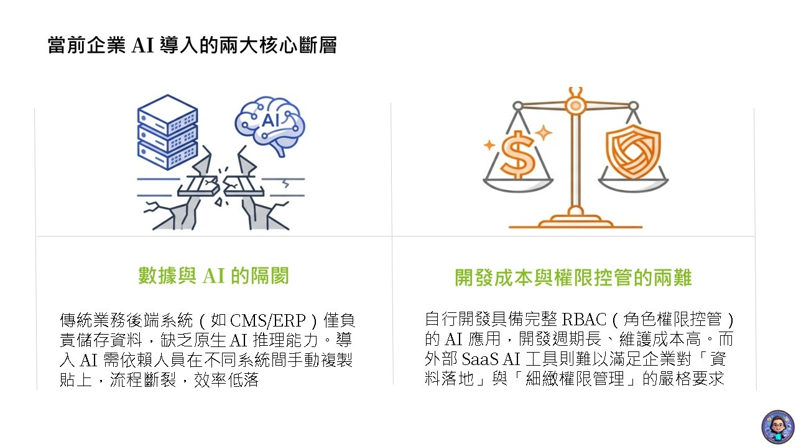
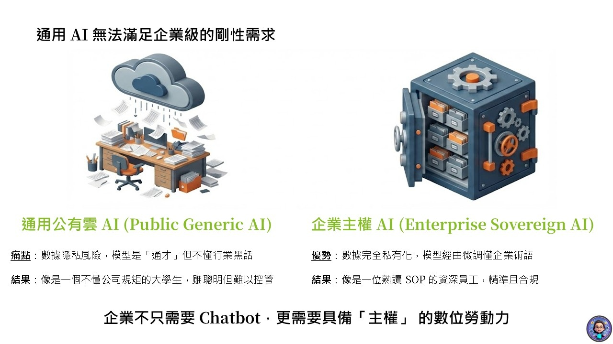
</p>

通用 AI 無法滿足企業的剛性需求：企業需要的不是單純的 Chatbot，而是具備『絕對主權』的數位勞動力。

* **通用公有雲 AI (Public Generic AI)**
  * 痛點：數據隱私風險，模型是「通才」但不懂行業黑話
  * 結果：像是一個不懂公司規矩的大學生，雖聰明但難以控管
* **企業主權 AI (Enterprise Sovereign AI)**
  * 優勢：數據完全私有化，模型經由微調懂企業術語
  * 結果：像是一位熟讀 SOP 的資深員工，精準且合規

---

<p align="center">
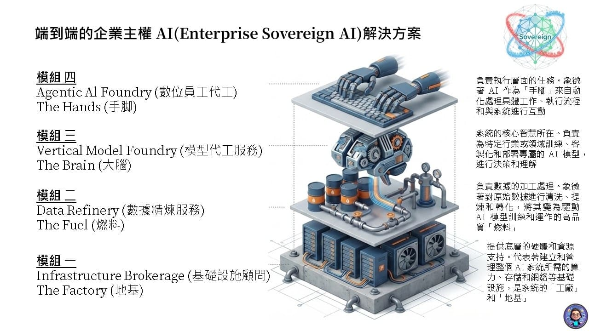
</p>

### <a id="end-to-end-modules"></a> 四大端到端鑄造模組：打造專屬 AI 生態系 (Four End-to-End Foundry Modules)

* **模組一**：Infrastructure Brokerage (基礎設施顧問)，The Factory (地基)
  * 提供底層的硬體和資源支持。代表著建立和管理整個 AI 系統所需的算力、存儲和網絡等基礎設施，是系統的「工廠」和「地基」。
* **模組二**：Data Refinery (數據精煉服務)，The Fuel (燃料)
  * 負責非結構化數據的降噪與逆向工程。徹底揚棄傳統的文本切塊 (Chunking)，透過「無向量視覺檢索 (Vectorless Vision RAG)」架構，實現保留原始排版與表格結構的「無損解析」。並可無縫對接 Data Designer 等工具，將死板法規自動轉化為高品質的指令微調 (Instruction-Tuning) 數據集，淬鍊出純淨的 AI 燃料。
* **模組三**：Vertical Model Foundry (模型代工服務)，The Brain (大腦)
  * 系統的核心智慧所在。接收模組二的精煉數據，進行深度微調 (Fine-tuning)，為高度監管領域鑄造出一顆 100% 精通企業專屬術語、內部合規邏輯，且資料絕對不落地的「主權大腦」。
* **模組四**：Agentic AI Foundry (數位員工代工)，The Hands (手腳)
  * 負責執行層面的任務。象徵著 AI 作為「手腳」來自動化處理具體工作、執行流程和與系統進行互動。
* **模組五**：Automated Audit & Assurance (自動化審計與合規)，The Scale (法槌與天平) 🛡️
* 負責系統的終極合規。內建 **Actor-Judge 雙腦架構**，以 `PyRIT` / `Inspect AI` 為大腦中樞，自動調度 20+ 套 AI 資安攻防兵器（如 `Garak`, `TruLens`, `GuardVal`），對系統進行極限壓力測試，並將防禦數據一鍵封裝為具備公信力的《ISO 42001 獨立驗證報告底稿》。

<p align="center">
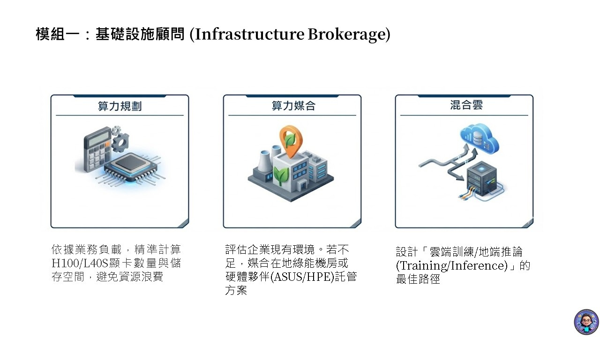
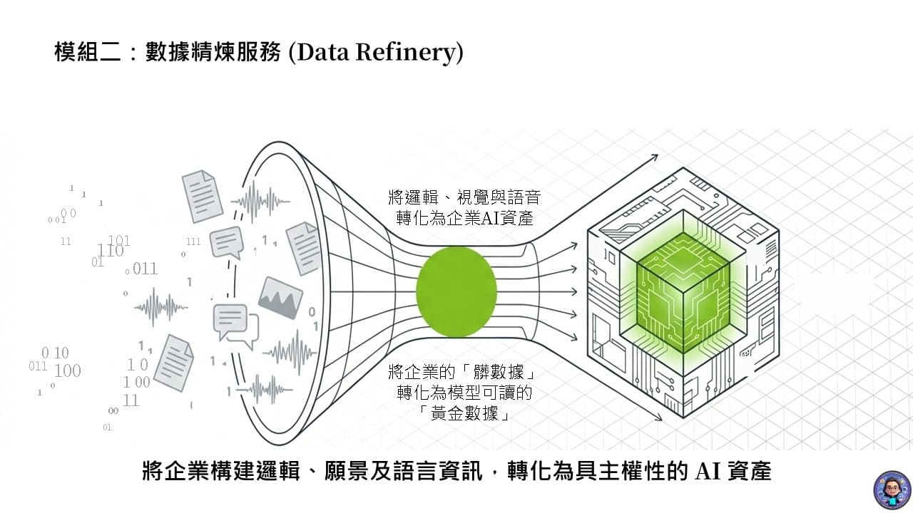
</p>
<p align="center">
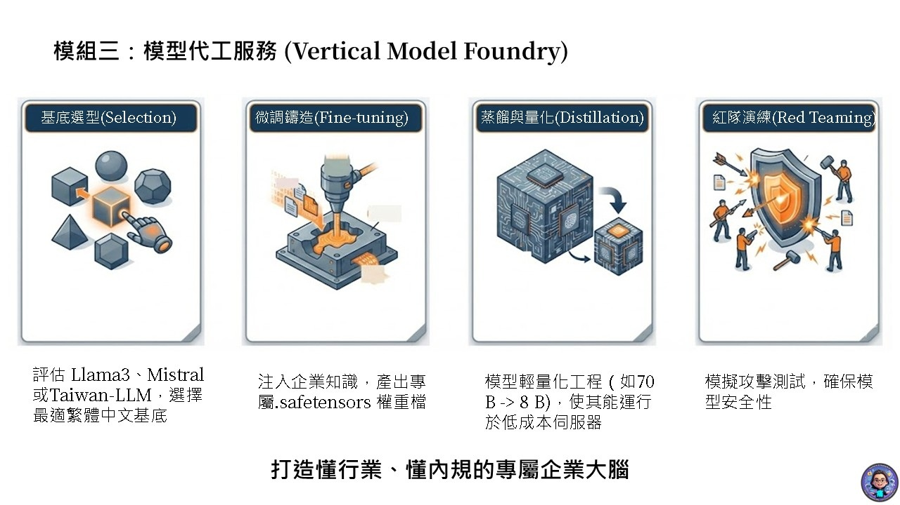
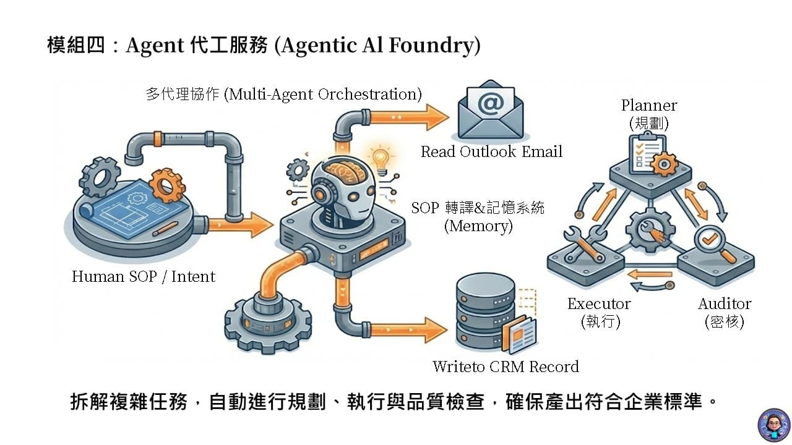
</p>

---

### <a id="core-philosophy"></a> 核心設計理念：Clean (乾淨)、Smart (聰明)、Lean (精實)、Safe (放心)

<p align="center">
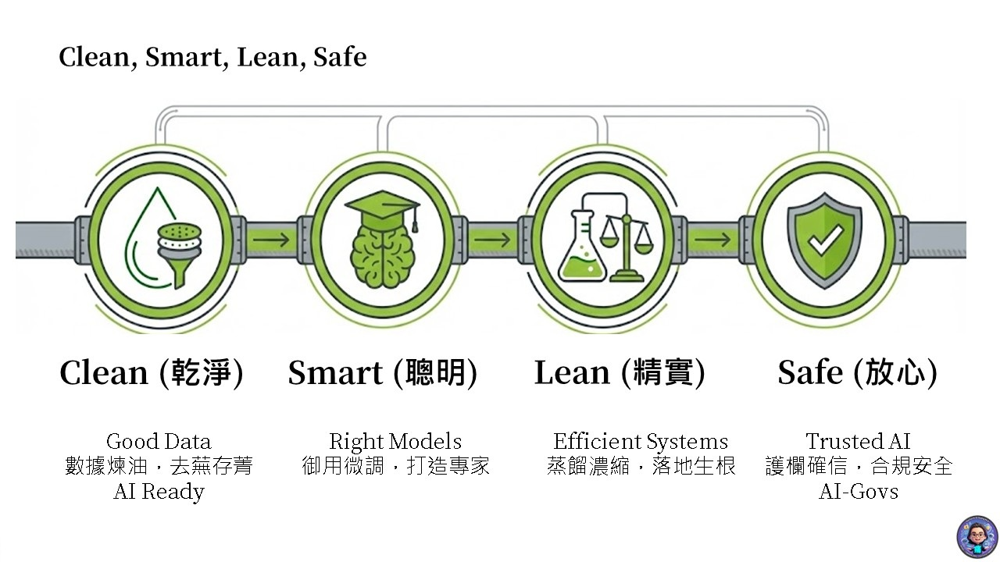
</p>

<p align="center">
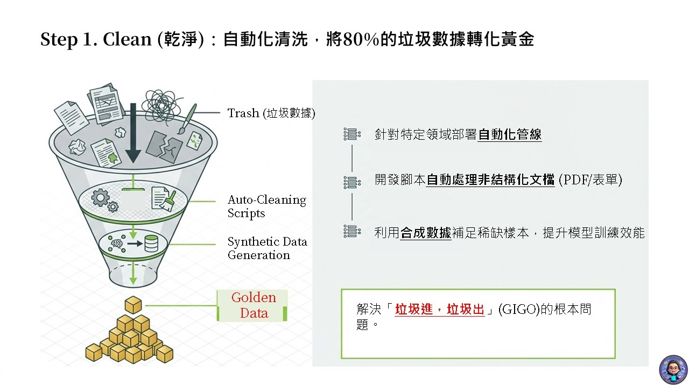
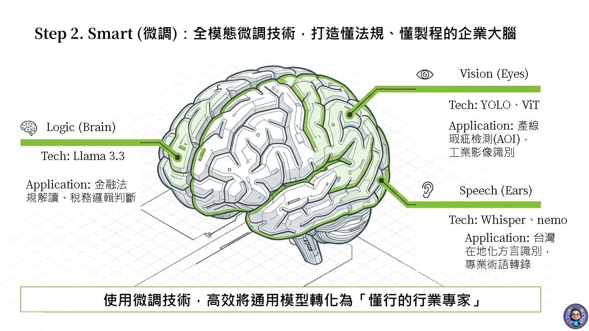
</p>
<p align="center">
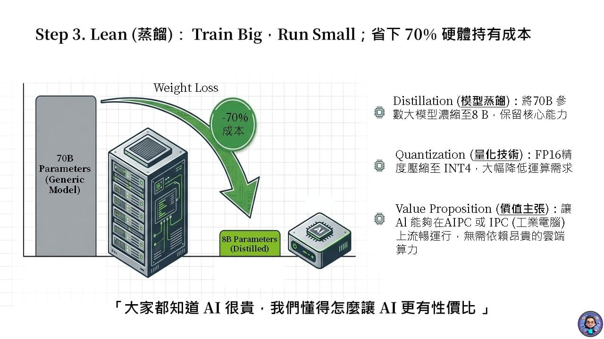
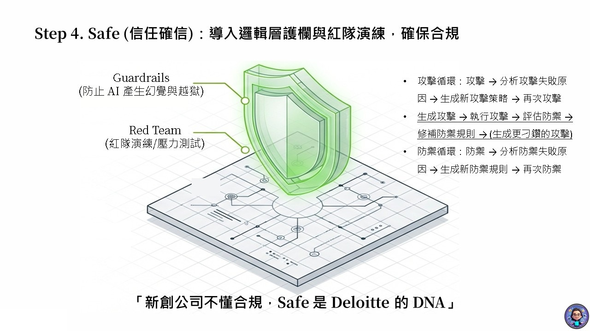
</p>

* **Step 1. Clean (乾淨)**：自動化清洗，捨棄易破壞上下文與表格的傳統文字切片，保留 PDF 原生排版與目錄樹，將 80% 難以消化的非結構化文檔，轉化為具備空間邏輯的高品質數據。
* **Step 2. Smart (微調)**：將前述清洗出的黃金合成數據 (Synthetic Data) 注入模型，透過微調打造真正懂企業黑話、懂製程法規的專屬大腦。
* **Step 3. Lean (蒸餾)**： Train Big, Run Small；導入無向量視覺檢索 (Vectorless Vision RAG) 與模型量化，省下 70% 算力與硬體持有成本。
* **Step 4. Safe (放心)**：導入邏輯層護欄與紅隊演練，確保合規。

---

## <a id="overview"></a>📖「Sovereign Heuristic Intelligence & Enterprise Logic Defense (S.H.I.E.L.D.) 」

> 主權啟發式情資與企業邏輯防禦系統 專案概述 (Overview)

<p align="center">
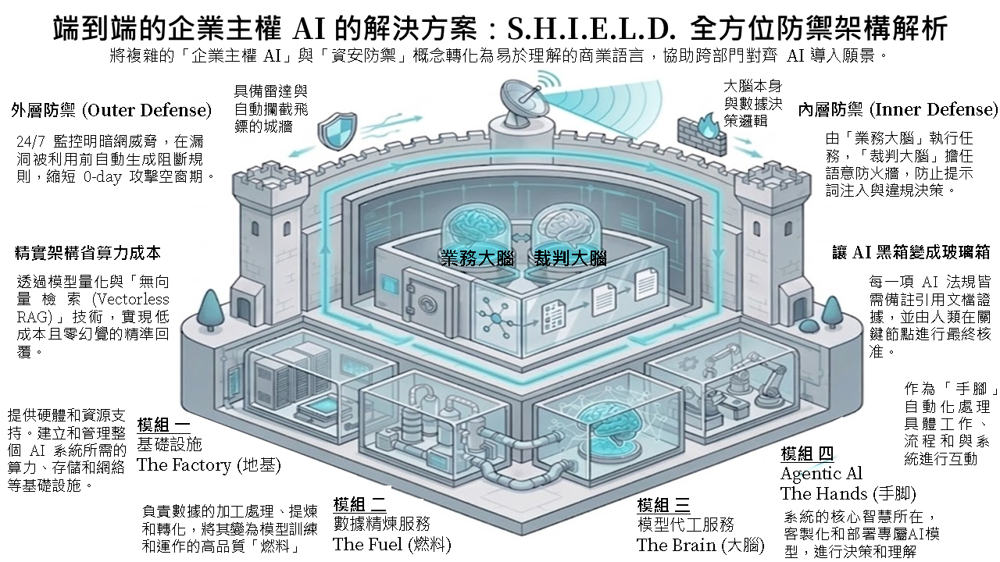
</p>

---

<div style="display: flex; justify-content: center;">
  <div style="position: relative; width: 100%; max-width: 460px; aspect-ratio: 16 / 9;">
    <iframe
      src="https://www.youtube.com/embed/umA6nOPPUhU"
      style="position: absolute; width: 100%; height: 100%; left: 0; top: 0;"
      frameborder="0"
      allow="accelerometer; autoplay; clipboard-write; encrypted-media; gyroscope; picture-in-picture"
      allowfullscreen>
    </iframe>
  </div>
  <div style="position: relative; width: 100%; max-width: 460px; aspect-ratio: 16 / 9;">
    <iframe
      src="https://www.youtube.com/embed/ZMbDVqEZ2gA"
      style="position: absolute; width: 100%; height: 100%; left: 0; top: 0;"
      frameborder="0"
      allow="accelerometer; autoplay; clipboard-write; encrypted-media; gyroscope; picture-in-picture"
      allowfullscreen>
    </iframe>
  </div>
</div>

<p align="center">
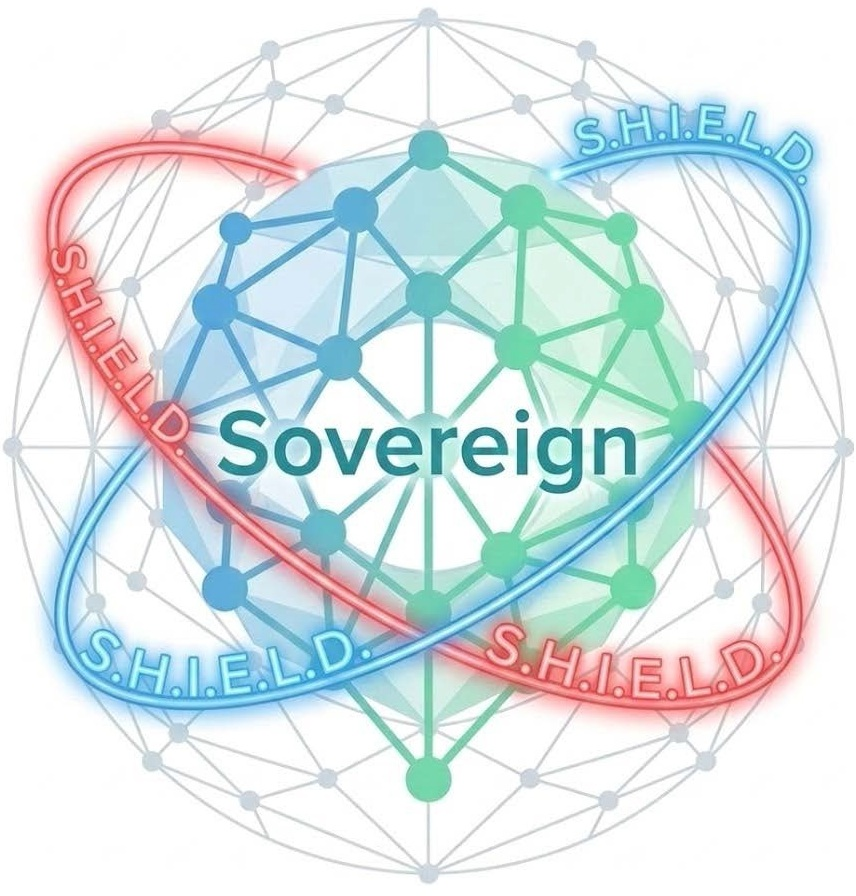
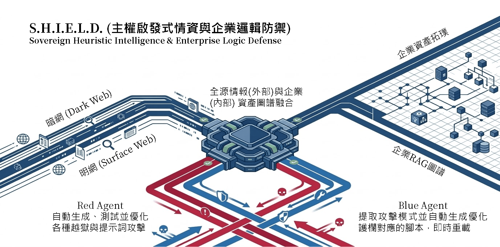
</p>

---

### <a id="background"></a> 創意發想背景及概述：從對話框到數位勞動力

在短短不到兩年的時間裡，企業 AI 的應用典範已經歷了三次劇烈的底層革命。S.H.I.E.L.D. 的誕生，正是為了解決前兩個世代的致命缺陷，並定義第三世代的企業安全標準：

<p align="center">
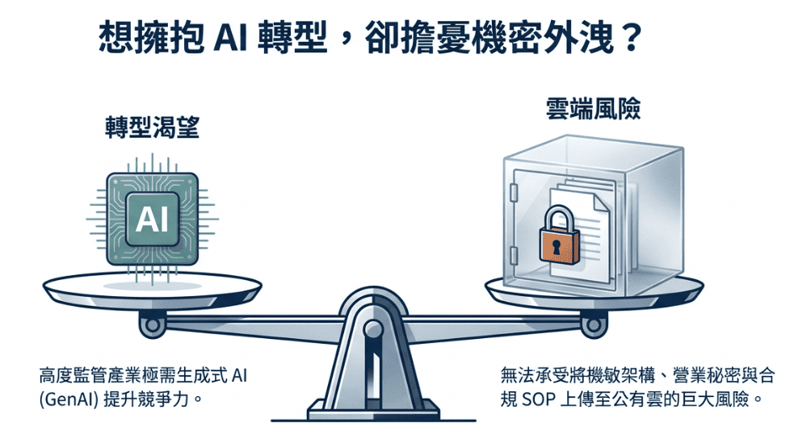
</p>


* **💡 Gen 1: 提示詞時代 (The Prompt Era, 2022~2023)**
  早期依賴單次問答與公有雲模型。企業痛點在於：模型不懂企業黑話，且將機密貼入公有雲對話框，引發了嚴重的資料外洩危機。
* **📚 Gen 2: 上下文時代 (The Context/RAG Era, 2023~2024)**
  企業開始狂建 Vector DB，導入檢索增強生成 (RAG)。企業痛點在於：傳統 RAG 將精美的財報與法規表格切得支離破碎，導致嚴重的「檢索幻覺 (Hallucination)」；更致命的是，AI 依然只是個「讀稿機」，只會給建議，無法動手解決問題。
* **🦞 Gen 3: 線束與代理人時代 (The Harness & Agentic Era, 2025~未來)**
  AI 從單純的聊天機器人，進化為具備工具調用 (Tool-use) 與多腦協作的**數位員工 (Digital Workforce)**。這正是 **S.H.I.E.L.D.** 的終極型態：我們不僅建構大腦，更透過 Agent Harness 賦予 AI 安全執行的手腳。

<p align="center">
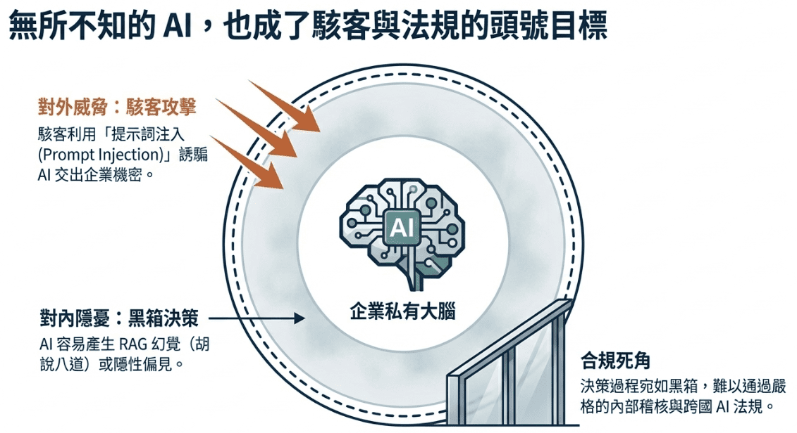
</p>

**【S.H.I.E.L.D. 的誕生與雙重防禦危機】**

在上述 Gen 3 的演進下，金融、政府與半導體等高度監管產業極需 AI 轉型，但無法承受將內部機敏拓樸、營業秘密上傳至公有雲的風險。因此，打造企業專屬的 **Private Cloud** 與 **Proprietary Brain (主權大腦)** 已成為不可逆的趨勢。

然而，當主權 AI 透過微調吸收了企業所有的機密邏輯後，這顆「無所不知的私有大腦」立刻面臨著雙重危機：
* **對外：** 淪為駭客利用「提示詞注入 (Prompt Injection)、底層技術弱點 (0-day) 潛入、癱瘓基礎設施或發動勒索攻擊」竊取機密的終極目標。
* **對內：** AI 的「黑箱決策」、「隱性偏見」與「RAG 幻覺」是通過內部稽核與法規監管的致命傷。

為此，我們開發了 **S.H.I.E.L.D.**。專為「企業主權 AI」量身打造，利用強大算力向外跨足明暗網狩獵威脅，向內進行深度連鎖關聯推理（融合 Vectorless RAG 與圖譜引擎），並結合 ChatOps 授權機制，賦予企業 AI 察覺威脅、保護機密與自我修復的強韌生命力。

* **當駭客從「網路連線」打過來**：Phase 2 暗網探針預警 ➡️ 左腦 GraphRAG 找受災範圍 ➡️ 右腦 Vectorless RAG 翻應變手冊 ➡️ 寫出 Snort 規則並派發 Agent 修補。**（這是外層網路熱修補）**
* **當駭客從「對話框文字」打過來**：紅藍隊平時的演練成果發揮作用 ➡️ NeMo Guardrails 啟動 ➡️ Nemotron-Safety-Guard 判定這是越獄攻擊 ➡️ 直接拒絕回答。**（這是內層語意防火牆）**

---

### <a id="features"></a> 功能簡介及特色

<p align="center">
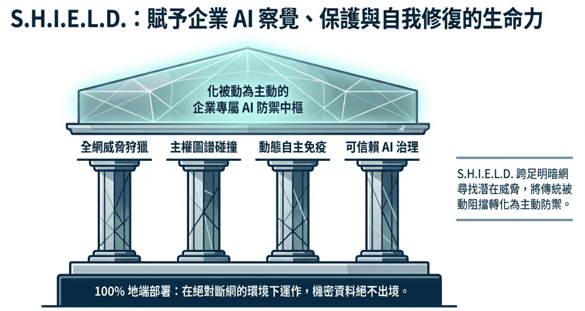
</p>

<p align="center">
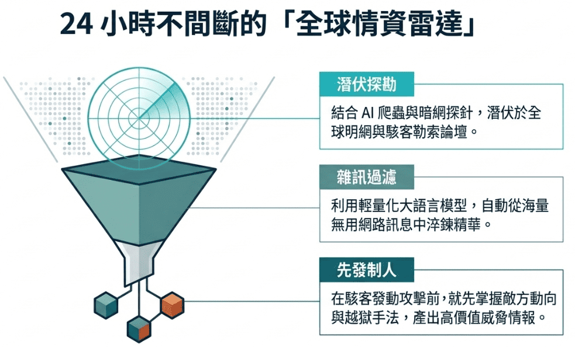
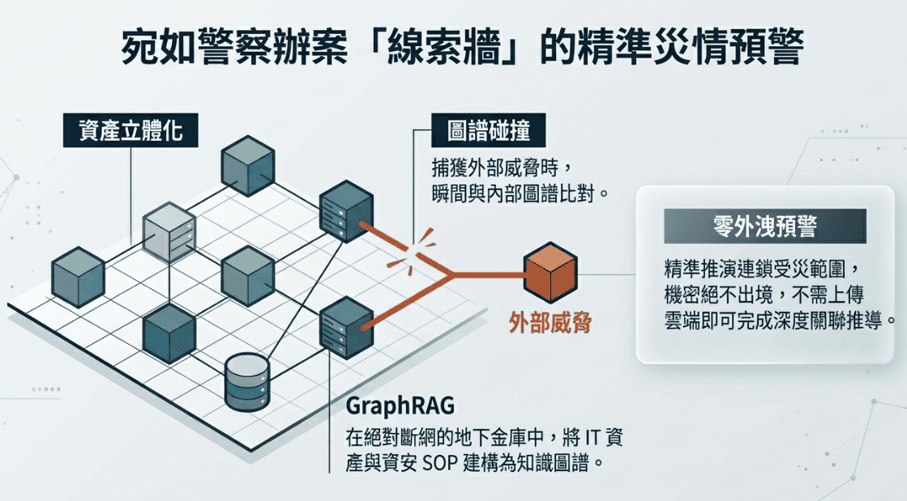
</p>

S.H.I.E.L.D. 具備顛覆傳統資安被動防禦思維的核心特色，為企業主權大腦建構了四大主動免疫機制：

* **跨越明暗網的全網威脅狩獵 (Omni-Source Threat Hunting)**
  * 不依賴傳統關鍵字盲搜，自主感知企業底層技術棧，整合明網 AI 爬蟲與暗網洋蔥探針，7*24 潛伏於全球駭客論壇與勒索軟體洩漏網站；透過大語言模型過濾海量雜訊，淬鍊高價值威脅情報。
* **雙引擎檢索與連鎖關聯推導 (Dual-Engine Collision & Retrieval)**
  * 將企業極機密的 IT 拓樸與資安 SOP 建構為**防禦知識圖譜**；突破傳統單一 RAG 的幻覺盲區。當捕獲外部威脅時，由左腦 (Sovereign GraphRAG) 進行語意映射，立體推演受災爆炸半徑與波及資產；同時觸發右腦 (Vectorless RAG) 如人類翻書般，精準抽取出對應的企業 SOP 與機密法規原文。雙腦完美接力，確保 AI 處置預警 100% 奠基於真實內規。
* **零時差主動免疫與網路熱修補 (Zero-Day Auto-Remediation)**
  * 威脅意圖解析： 閱讀駭客論壇中的漏洞利用程式碼 (Exploit/PoC)。
  * 網路層防禦生成： 轉譯對應的 Snort IDS/IPS 或 ModSecurity WAF 阻擋規則，實現「威脅預判，即刻阻斷」。
* **零信任 AI 治理與雙腦防禦 (Zero-Trust AI Governance)**
  * 針對「企業 AI 大腦」本身的認知層弱點，內建業務與裁判「雙腦架構」。透過多代理人 (Multi-Agent) 進行不間斷的攻防演練與護欄重載，確保模型決策 100% 合規、透明且具備無懈可擊的可追責性。

---

### <a id="implementation"></a> ⚔️ 外層防禦：主動免疫機制與運行階段展示 (物理與網路的護城河)： 阻擋「傳統駭客攻擊」，不讓威脅碰觸到企業網路。

👉 核心目標：禦敵於國門之外，縮減 0-day 漏洞的空窗期。

作為 S.H.I.E.L.D. 向外打擊與防堵的利器，上述的核心防禦機制具體化為四個動態運行階段 (Phases)，結合完善的健康度監測，構築了堅不可摧的企業外圍防護網：

<p align="center">
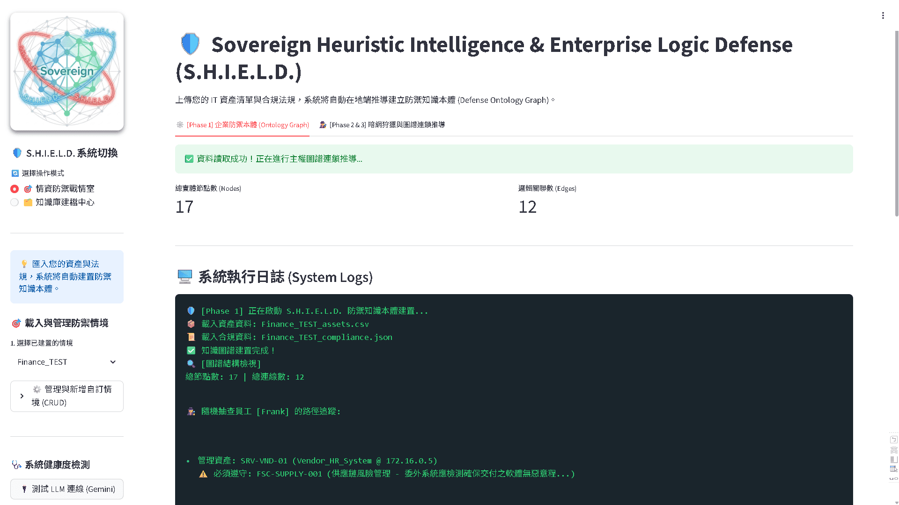
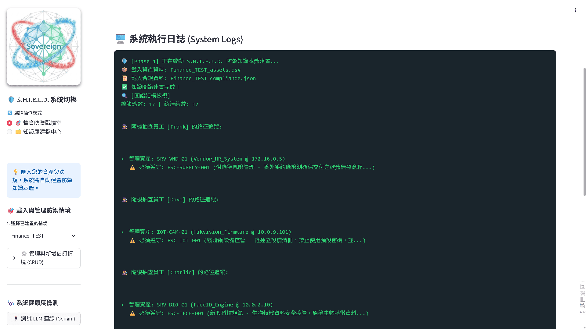
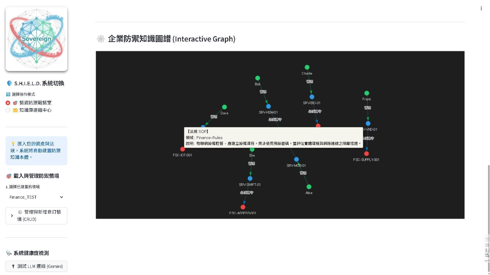
</p>

* **🕸️ Phase 1: 企業防禦本體建置 (Ontology Graph)**  
無縫介接內部 CMDB 與 GRC 系統。結合「圖譜拓樸」與「無向量視覺檢索 (Vectorless Vision RAG)」，在斷網環境下同時萃取結構化資產與長篇機密法規，渲染為互動式大腦；就像是先畫出城堡的詳細地圖，並讓大腦完美熟記每一條內部守則。  
👉 將過去需要數週的人工資產與法規盤點，轉化為即時更新的數位戰情圖，大幅降低合規稽核成本。

<p align="center">
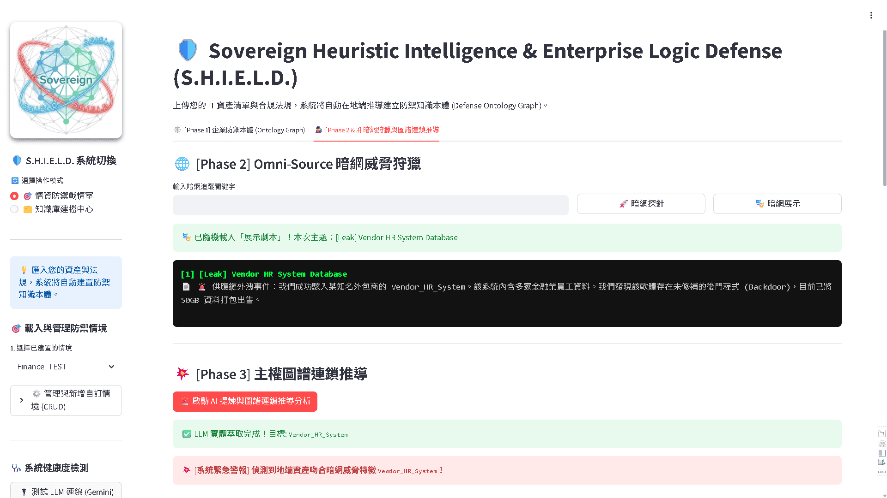
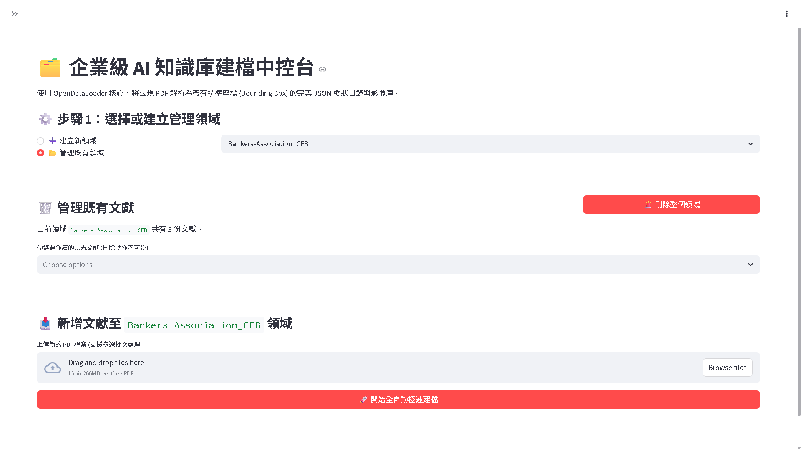
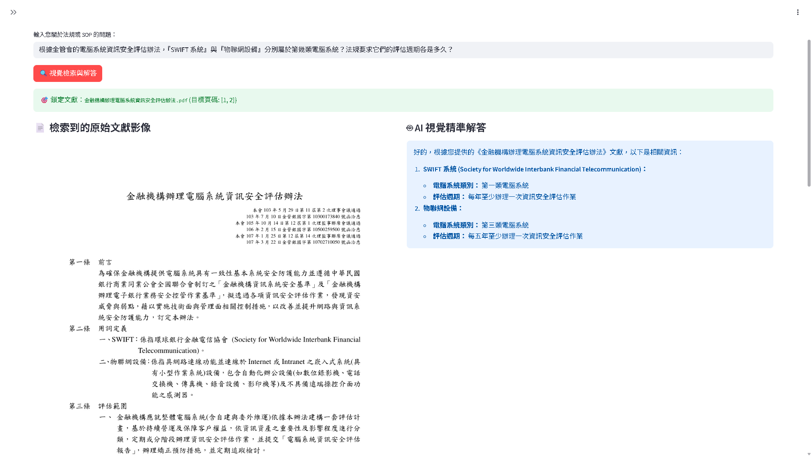
</p>

* **🕵️‍♂️ Phase 2: 暗網威脅狩獵 (Dark Web Hunting)**  
內建雙棲數位探針與動態模型路由 (支援 vLLM/Ollama 邊緣推論)。支援真實暗網連線，確保任何環境下皆能火力展示；就像是主動派斥候出城打探情報，而不是等敵人兵臨城下才拉警報。  
👉 降低 0-day 漏洞的致命空窗期，讓企業從「被動等著被駭」升級為「主動攔截威脅」。

<p align="center">
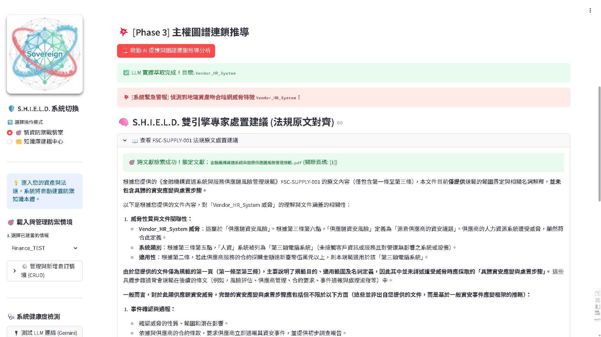
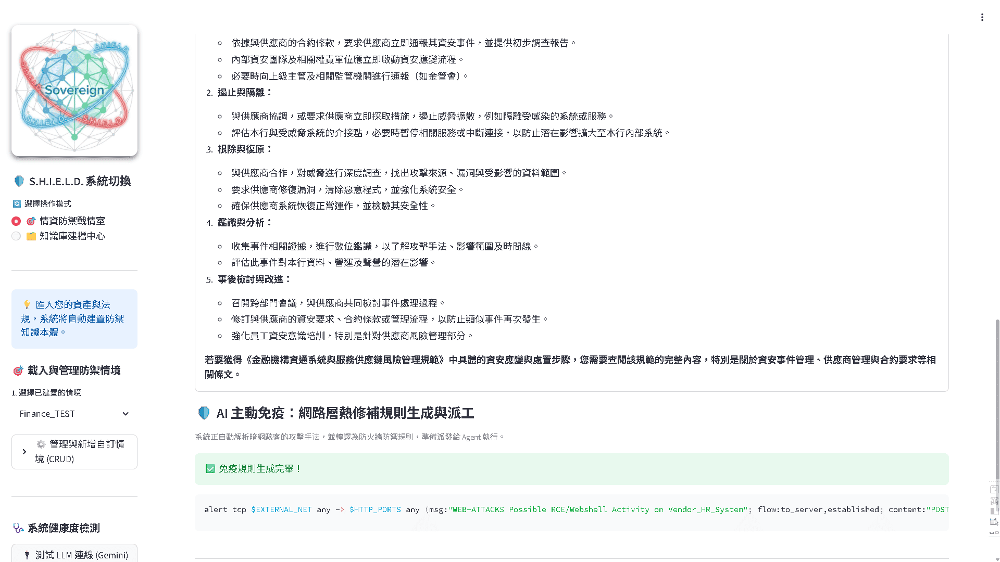
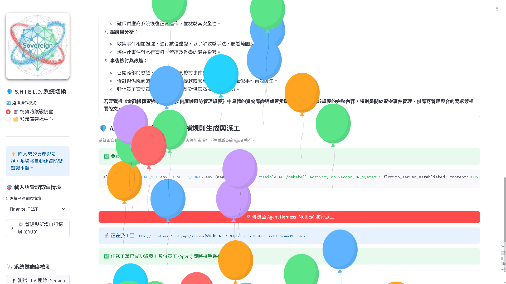
</p>

* **💥 Phase 3: 雙引擎推導與任務封裝 (Dual-Engine Collision & Task Packaging)**  
將抓取到的 0-day 威脅注入系統，由圖譜推導受災範圍，並連動無向量視覺檢索 (Vectorless Vision RAG) 提取對應的處置 SOP。LLM 融合兩方情報精準轉譯出 Snort/WAF 阻擋規則後，**不再依賴人工複製貼上**。系統將透過 API 將威脅上下文與防禦指令打包成標準化的 Issue (工單)，派發給地端的 **Multica (Agent Harness)** 進行生命週期管理。  
👉 將傳統需要跨部門開會數天才能擬定的防火牆防禦策略，壓縮成「秒級」的標準化數位工單。

<p align="center">
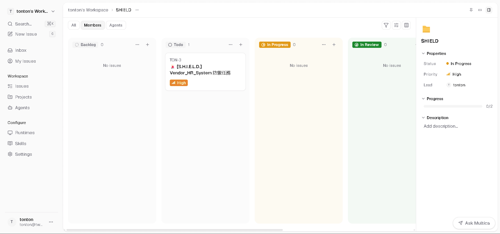
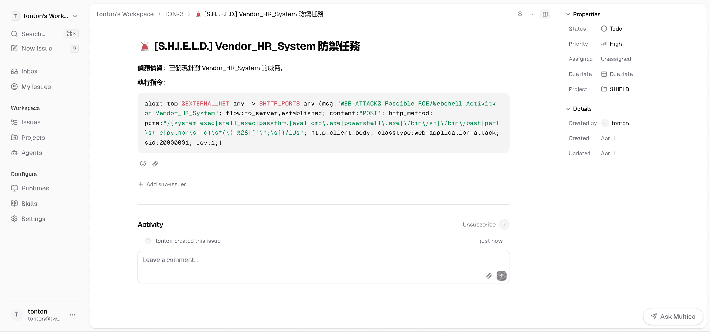
</p>

* **🦞 Phase 4: ChatOps 審批與全自主修補 (ChatOps & Autonomous Remediation)**  
接收到 Multica 任務的 **[OpenClaw Agent](https://deep-learning-101.github.io/Agent/OpenClaw-Moltbot-Clawdbot)**，將透過 **LINE** 或企業通訊軟體向資安主管發送緊急授權請求。在取得人類主管的「Y (同意)」指令後 (Human-in-the-loop)，OpenClaw 將在地端沙盒中自主透過 SSH 登入防火牆，執行阻斷規則並回報結案。  
👉 讓 AI 真正長出手腳，實現「威脅預判 ➔ 授權審批 ➔ 自動修補」的零時差終極閉環。

<p align="center">
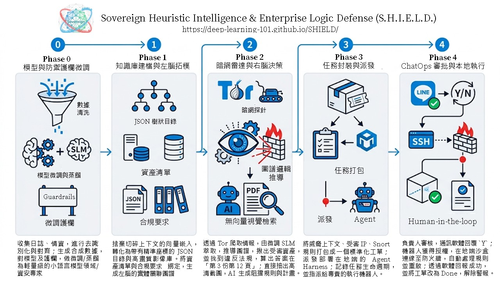
</p>

* **🩺 系統健康度監測 (Health Checks)**  
內建即時監控面板，一鍵測試 LLM API 連線狀態、Tor SOCKS5 代理器存活度，以及多個暗網搜尋引擎的 Ping 延遲。

---

### <a id="trustworthy-ai-governance"></a> **🧠 內層防禦：雙腦架構與企業級可信賴 AI 治理** (認知與語意的貼身保鑣： 阻擋「AI 提示詞攻擊與系統幻覺」，不讓 AI 大腦被騙或做錯決定。)

👉 核心目標：防堵提示詞注入、越獄騙局與 AI 幻覺，並產出符合 ISO 42001 的獨立驗證報告。

在外部的威脅狩獵與網路熱修補 (Phase 1~3) 之外，針對「企業 AI 大腦本身」的語意安全與合規性，S.H.I.E.L.D. 導入了核心的**微調技術 (Fine-Tuning)** 與**邏輯層護欄 (Guardrails)**，並嚴格落實 **[企業級 AI 標竿分析與負責任 AI 治理建議](https://deep-learning-101.github.io/Blog/AI-Govs)**：

<p align="center">
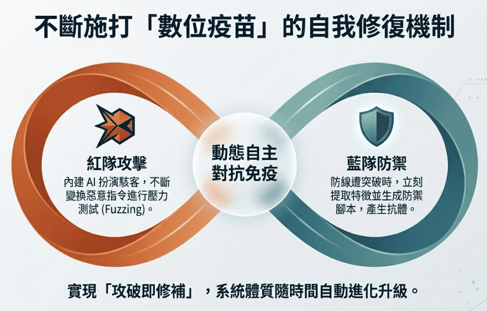
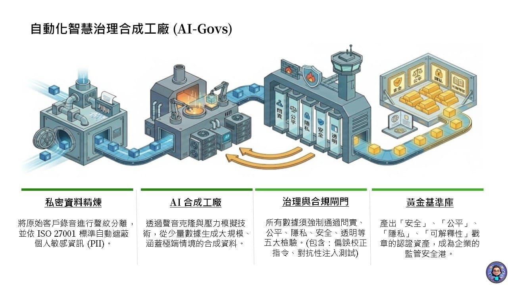
</p>

#### **🤖 Phase 5: 全自動 AI 治理與合規審計工作流 (Automated Assurance Pipeline)**

* **1. 審計大腦排程 (The Orchestrator)**
* 採用 `Microsoft PyRIT` / `Inspect AI` 作為中央控制台，全自動排程並呼叫下方所有兵器。

* **2. 靜態與供應鏈聯防 (Static Audit)**
* 透過 `DeepAudit` 掃描程式碼漏洞，`Protect AI` 攔截被植入木馬的開源權重 (.safetensors)，並使用 `IBM AIF360` 確保訓練資料無算法偏見。

* **Actor-Judge 雙腦架構 (Dual-Brain Defense)**：跳脫單一模型的風險盲區，建立極致的內網防禦。
  * **Actor (業務大腦)**：將企業內部 SOP 與機敏拓樸進行微調，打造 100% 懂企業黑話與製程的主權大腦。
  * **Judge (裁判大腦/護欄)**：隱藏於底層的微調裁判模型，建構動態語意防火牆。專職防範提示詞注入 (Prompt Injection) 與惡意越獄，確保業務大腦不被操弄。
* **紅藍隊自主對抗 (Autonomous Teaming)**：
  * **紅軍 Agent**：不間斷生成變異提示詞 (Prompt Fuzzing) 進行系統越獄與竊密測試；以 `Gemma-4-31B-CRACK` (無審查模型) 作為引擎，掛載 `Garak` 與 `FuzzyAI`，發動數萬次越獄與提示詞注入攻擊。
  * **藍軍 Agent**：提取攻擊特徵，熱重載邏輯層護欄，將防禦升級為具備神經可塑性的主動免疫系統；企業前緣部署 `NVIDIA NeMo Guardrails`，內載 `ShieldGemma 2` 與 `微調 ModernBERT` 構成的毫秒級雙層護欄；並以 `Microsoft Presidio` 進行即時 PII 遮罩。
* **量化裁判與一鍵出報告 (The Judge)**
* 攻擊結束後，自動呼叫 `GuardVal` 計算護欄的漏擋率 (MAPR)，呼叫 `TruLens/Ragas` 精準量化 RAG 系統的幻覺分數 (Groundedness)。
* **合規映射**：將上述量化數據，透過 GraphRAG 自動對齊 **ISO/IEC 42001** 控制項，一鍵產出具備第三方公信力的《AI 系統獨立驗證報告底稿》。

透過內建此機制，我們完美落實了透明性、可解釋性 (透過 `SHAP` 特徵歸因)、公平性與問責機制。

<p align="center">
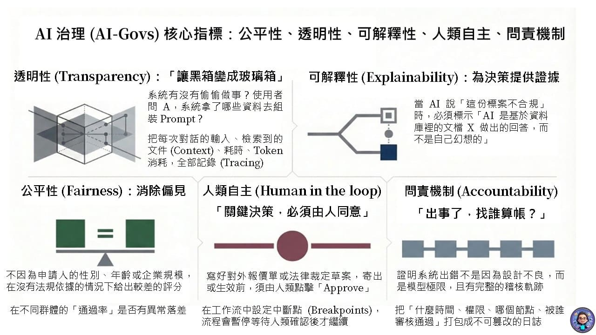
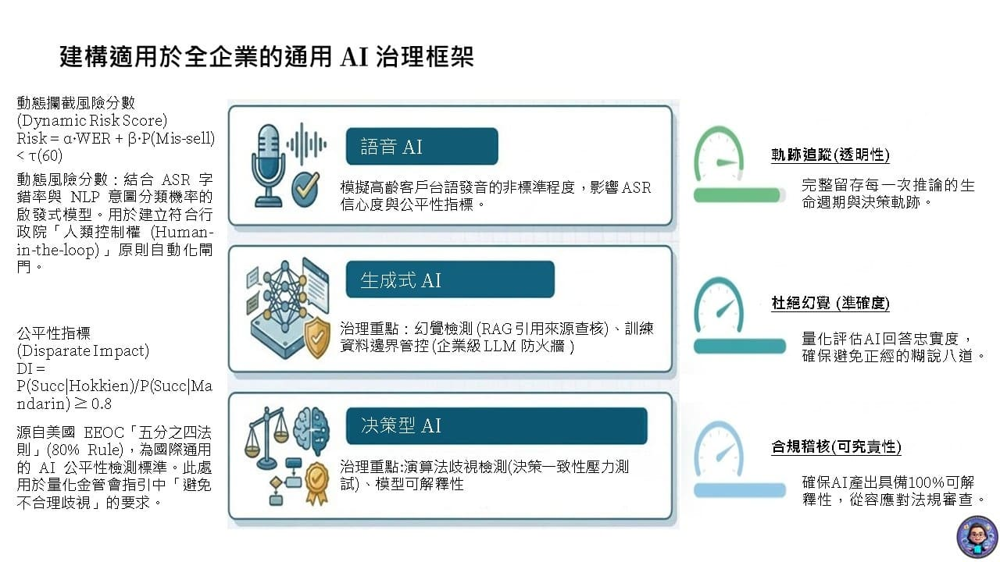
</p>

* **透明性 (Transparency)**：「讓黑箱變成玻璃箱」；系統有沒有偷偷做事？使用者問了 A，系統背後到底拿了哪些資料去組裝 Prompt？把每一次對話的輸入、檢索到的文件 (Context)、耗時、Token 消耗，全部記錄 (Tracing)。
* **可解釋性 (Explainability)**：「給出決策的理由」；當使用者問「你憑什麼給出這個答案」時，系統能給出證據。當 AI 說「這份標案不合規」時，必須標示出「AI 是基於資料庫裡的文檔 X 做出的回答，而不是自己幻想的。」
* **公平性 (Fairness)**：「一視同仁，沒有偏見」；不能因為申請人的性別、年齡或企業規模，而在沒有法規依據的情況下給出較差的評分。透過統計學與紅隊測試，掃描模型在不同群體上的「通過率」是否有異常落差。
* **人類自主 (Human in the loop)**：「關鍵決策，必須由人類批准」；寫好對外報價單或法律裁定草案，但寄出或生效前，必須由人類點擊「Approve」。工作流中設定「中斷點 (Breakpoints)」，跑到一半會暫停，等待人類確認後才繼續。
* **問責機制 (Accountability)**：「出事了，找誰算帳？」；證明系統出錯不是因為設計不良，而是模型極限，且我們有完整的稽核軌跡。把「在什麼時間、用什麼權限、觸發哪個 AI 節點、被誰審核通過」打包成不可篡改的日誌。

---

### 📊 內外防禦一覽表

S.H.I.E.L.D. 的外層防禦，負責把駭客與病毒擋在網路邊界之外；而內層防禦，則是為企業的 AI 大腦穿上防彈衣，確保它吐出的每一句話都安全、聰明且絕對合規。

| 比較維度 | ⚔️ 外層防禦 (Outer Defense) | 🧠 內層防禦 (Inner Defense) |
| :--- | :--- | :--- |
| **防禦目標** | 企業基礎設施 (伺服器、網路)、IT 資產 | 企業主權 AI 大腦本身、數據決策邏輯 |
| **對抗威脅** | 0-day 漏洞、惡意軟體、進階持續性威脅 (APT)、已知駭客攻擊 (PoC) | 提示詞注入 (Prompt Injection)、越獄騙局、AI 幻覺 |
| **運作機制** | 向外狩獵 (暗網) ➔ 雙引擎檢索推演 ➔ 網路層熱修補 | 向內微調 (SOP) ➔ 護欄審核 ➔ 紅藍隊攻防演練 |
| **防護領域** | 傳統資訊安全 (Cybersecurity) | AI 安全與治理 (AI Safety & Governance) |
| **白話比喻** | 具備雷達的城牆防禦系統，精準推演敵軍路徑並自動發射攔截導彈 | 國王身邊的貼身侍衛與最高檢察官，防止國王被奸臣洗腦或做出違憲決策 |

---

### <a id="tech-stack"></a> 開發工具與技術


#### 1. 核心開發工具

| 應用領域 / 功能 | 核心工具與套件 | 說明與效益 |
| :--- | :--- | :--- |
| **企業大腦微調與部署** | `Unsloth` / `vLLM` / `Ollama` | 極速微調企業專屬業務模型，並於地端叢集高效推論，確保資料不落地。 |
| **AI 推論與萃取** | `Google GenAI`<br>`(Gemini-2.5-flash)` | 提供強大推論能力，並可無縫切換本機端 `Ollama` 實現 100% 離線推論。 |
| **AI 數據精煉與合成<br>(Data Refinery)** | `PageIndex` / `OpenDataLoader-PDF` / `NVIDIA NeMo Retriever` / `NVIDIA NeMo Data Designer` | 突破 PDF 解析極限，並結合 NeMo 工具鏈自動化生成高保真合成數據，為大腦提供純淨微調燃料。 |
| **自動化與圖譜運算<br>(GraphRAG Engine)** | `Streamlit` / `NetworkX` / `PyVis` | 互動式威脅拓樸渲染與連鎖衝擊路徑可視化。開源版提供 CSV 匯入作 PoC 驗證，真實環境可透過 Enterprise Connectors 介接。 |
| **AI 治理與語意防火牆** | `NVIDIA NeMo Guardrails` / `Nemotron-Safety-Guard` | 建構可程式化的邏輯護欄，微調並部署專職裁判模型，防範提示詞注入與違規決策。 |
| **決策軌跡與紅藍對抗** | `LangGraph` / `Langfuse` | 建構多代理人 (Multi-Agent) 攻防狀態機，完整記錄 AI 思考日誌以落實可追責性。 |
| **暗網與情資探勘** | `Tor (SOCKS5 Proxy)` / `Headless OSINT Scraper` | 隱匿追蹤並深潛暗網駭客論壇，客製化萃取高價值的零時差威脅情資。 |
| **數位員工與自動化** | `Hermes` / `OpenClaw` / `LINE Messaging API` | 導入擁有近 40 萬 GitHub Stars 的頂級 Agent 框架 OpenClaw。原生整合 LINE 實現 ChatOps 授權，賦予大腦安全、受控的本機執行能力 (SSH/CLI)。 |
| **多代理人基礎設施** | `Multica` | 作為 AI 團隊的任務看板與基礎設施 (Harness)。提供安全的執行沙盒、權限範圍 (Scope) 控管與工單指派，確保 OpenClaw 的每一次行動皆有跡可循。 |
| **靜態與供應鏈聯防** | `DeepAudit` / `Protect AI` / `Microsoft RAMPART` | 掃描底層程式碼漏洞與 RAG 權限缺陷；攔截遭竄改的模型權重，落實 CI/CD 安全迴歸測試。 |
| **動態護欄與隱私** | `NVIDIA NeMo Guardrails` / `ShieldGemma 2` / `Microsoft Presidio` / `Opacus` | 毫秒級雙層護欄攔截惡意越獄；即時文字 PII 動態遮罩；差異隱私數學邊界防護。 |
| **全自動審計與量化** | `Microsoft PyRIT` / `Garak` / `TruLens` / `GuardVal` / `IBM AIF360` | 構建全自動審計工作流。發動多輪漸強攻擊，並精準計算護欄防禦率與幻覺分數，自動對齊 ISO 42001 產出合規底稿。 |

<br>

#### 2\. 技術獨特性與差異化

| 核心技術亮點 | 獨特性與實作細節 |
| :--- | :--- |
| **傳統 RAG 演進至<br>雙引擎檢索**<br>*(Sovereign GraphRAG + Vectorless RAG)* | 徹底揚棄臃腫的向量資料庫 (Vector DB)：<br>• **針對結構化關聯**：採用圖論引擎進行立體映射推演，在地端讀取內部拓樸。<br>• **針對長篇機密文檔 (如 ISO/SOP)**：導入 Agentic Vectorless RAG (代理人無向量目錄索引) 實現 100% 零幻覺的精準導航。<br>• 兩者結合，建立公有雲無法跨越的絕對護城河。 |
| **LLM 雙層防禦與<br>雙腦架構**<br>*(Dual-Layer & Dual-Brain Defense)* | 跳脫單一模型的風險盲區，打造極致的內外防禦網：<br>• **對外 (網路層)**：以 LLM-to-IPS 實現自動化熱修補，縮短 0-day 空窗期。<br>• **對內 (認知層)**：導入 **「Actor-Judge 雙腦架構」**。由「業務大腦 (Actor)」負責深度情資推導；同時隱藏一個微調過的「護欄大腦 (Judge)」作為語意防火牆。結合紅藍隊動態 Fuzzing 持續鍛鍊護欄，將防禦升級為具備神經可塑性的「主動免疫系統」。 |
| **從龐大算力演進至<br>極致輕量**<br>*(Edge AI & Quantization)* | 採用知識蒸餾訓練專用 **SLM (Small Language Model)**：<br>• 導入 **4-bit 量化 (AWQ/GGUF)** 與語意路由 (Semantic Routing)。<br>• 大幅降低硬體 TCO (總體擁有成本) 門檻。 |
| **底層數據解析的<br>典範轉移**<br>*(Data Parsing Paradigm Shift)* | 捨棄傳統 1D 純文字流，邁向 2D 物理版面感知：<br>• **零 LLM 延遲建檔**：揚棄依賴昂貴 LLM 腦補目錄的舊法。導入 `OpenDataLoader`，利用底層電腦視覺瞬間抽取出帶有精準座標 (Bounding Box) 的實體 JSON 目錄，建檔過程 100% 零 LLM 呼叫成本。<br>• **消滅表格與排版幻覺**：本系統透過物理版面解析，完美識別 `heading`、`table`、`picture` 錨點，結合 PyMuPDF 截取原圖，確保圖文多模態資訊在建檔階段 0% 遺失。<br>• **絕對客觀的目錄樹 (Truthfulness)**：拒絕由 AI 總結出來的虛假目錄。檢索地圖 100% 建立在原生文檔的物理字體、縮排與版面上，徹底斬斷 RAG 在檢索前期的幻覺根源。 |

<p align="center">
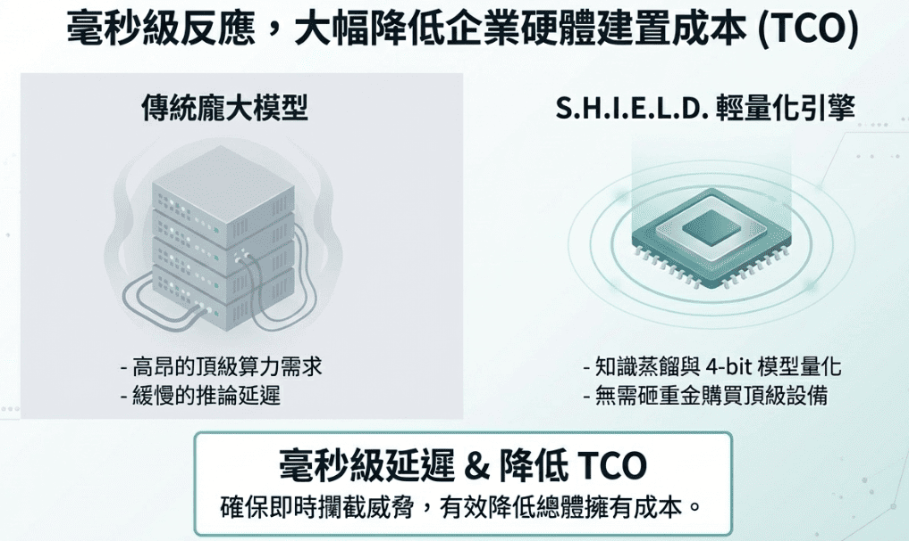
</p>

---

### <a id="usage-environment"></a> 使用對象及環境

* **目標對象：**  
  * 高度監管產業 SOC 團隊（金控、政府機關、國防單位）。  
  * 擁有核心機密之企業（晶圓代工廠、高科技製造業）。  
* **軟硬體環境 (100% 地端部署)：**  
  * **硬體：** 配備高效能 GPU 之企業級伺服器。  
  * **網路：** 支援完全隔離的內部網路環境 (Air-gapped)。  
  * **軟體：** Linux OS、Python 3.10+、Docker 容器化環境。  

---

### <a id="application"></a> 產業應用性

* **應用效益：** 解決 SOC 團隊「警報疲勞」，縮短威脅影響範圍評估時間（從數天降至分鐘級）。
* **商業價值：** 提供「安全附加價值」，協助客戶符合金管會或跨國 AI 法案稽核，加速 AI 專案簽約率。
* **社會影響力：** 在國家級網路戰中，保護關鍵基礎設施 (CI)，提升國家整體數位韌性。

<p align="center">
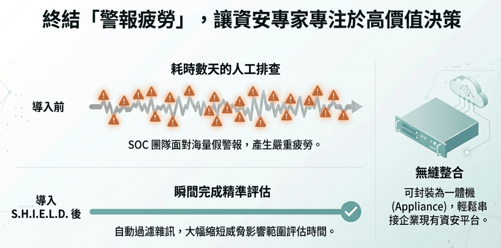
</p>

---

### <a id="trade-offs-mitigation"></a> 系統邊界與實戰權衡 (Trade-offs & Mitigation)

在資安的真實戰場中，沒有絕對完美的架構。S.H.I.E.L.D. 為了追求「絕對的資料主權與物理斷網」，在設計上做出了明確的戰略取捨。我們誠實面對地端系統的邊界，並以硬核技術進行完美緩解：

* **1. 情報廣度 vs. 上下文深度 (Threat Breadth vs. Contextual Depth)**
  * **邊界：** S.H.I.E.L.D. 依賴開源探針與暗網爬蟲，在全網情資的「絕對捕獲量」上，客觀上無法與擁有數百位人類分析師的雲端巨頭 (如 Google Mandiant) 匹敵。
  * **緩解 (S.H.I.E.L.D. 優勢)：** 我們放棄無意義的「大海撈針」，轉向 **「圖譜逆向驅動 (Graph-Driven Hunting)」**。探針不盲搜，而是由地端圖譜提取實際存在的技術棧 (如特定的 Apache 或 VPN 版本) 進行狙擊式監控。以「情報關聯的深度」取代「無意義的廣度」，徹底解決 SOC 團隊每天面對海量垃圾警報的疲勞。
* **2. 算力成本 vs. 極致精實架構 (Compute Cost vs. Lean Architecture)**
  * **邊界：** 在地端運行大語言模型，若再加上傳統的向量資料庫 (Vector DB) 與嵌入模型 (Embedding Models) 維護，傳統上需要極度昂貴的 GPU 算力機群，這對多數企業是極高的硬體門檻。
  * **緩解 (S.H.I.E.L.D. 優勢)：** 系統全面導入 Edge AI 輕量化工程 與 無向量架構。透過模型蒸餾與量化技術降低 VRAM 需求外，S.H.I.E.L.D. 更利用 Vectorless RAG 徹底移除了向量資料庫的建置與維護負擔。這讓主權大腦能在一般的商用伺服器上流暢運行，極大化 TCO (總體擁有成本) 的投資報酬率。
* **3. 模型退化 vs. 動態免疫 (Model Stagnation vs. Dynamic Immunity)**
  * **邊界：** 物理斷網的地端大腦若未與雲端同步更新，面對日新月異的 AI 越獄手法或變種攻擊，認知能力可能會產生退化或幻覺。
  * **緩解 (S.H.I.E.L.D. 優勢)：** 系統內建 **「多代理人紅藍對抗迴圈」** 作為內部健身房。平時由紅軍 Agent 不斷以突變提示詞 (Prompt Fuzzing) 對大腦進行壓力測試；藍軍 Agent 則自動萃取特徵並寫出新的邏輯護欄。透過無間斷的自我對抗，維持大腦的敏銳度與神經可塑性。

### <a id="result"></a> 結語

> 「安全、無懼地保護並使用專屬 AI」才是決勝 AI 的關鍵。

S.H.I.E.L.D. 透過向外的敏銳探勘、向內的圖譜深思，結合 **「網路層即時熱修補」與「紅藍隊自主大腦演化」** 的雙層免疫機制，為企業打造具備真實生命力的數位防禦中樞，引領台灣產業邁向真正安全的主權 AI 時代。

---

### <a id="enterprise"></a> 💼 企業版與專業顧問服務 (Enterprise Edition & Services)
S.H.I.E.L.D. 開源版本提供核心的防禦框架與概念驗證 (PoC) 工具。針對高度監管產業與大型企業的實戰需求，我們提供客製化的導入服務與企業版授權：

* **🔌 Enterprise Connectors (企業系統橋接器)**：取代基礎的 CSV 匯入 (`init_ontology.py`)，提供與 ServiceNow、Active Directory、GRC 系統的自動化 API 同步，動態即時更新防禦圖譜。
* **🏭 Sovereign Data Pipeline (主權數據管線建置)**：提供基於 `NVIDIA NeMo Data Designer` 的完整微調數據生成腳本與參數調優顧問服務，確保模型 100% 理解企業專屬術語與 SOP。
* **🛡️ Dynamic Access Control (動態權限檢索)**：進階版的 PageIndex 架構，結合企業 IAM (身分識別) 機制，確保不同層級的員工在觸發圖譜碰撞時，只能調閱其權限內的法規處置建議。
* **📡 Managed Threat Intelligence Feed (託管式暗網情資訂閱)**：企業無需承擔自建 Tor 節點與維護爬蟲基礎設施的合規風險 (OPSEC)。我們提供 7x24 小時的雲端暗網深潛與清洗服務，將針對貴公司技術棧的高價值威脅情報（如 0-day 漏洞、外洩憑證），透過安全的專屬 API 直接推播至地端 S.H.I.E.L.D. 大腦觸發防禦機制。

📩 **商務合作與技術諮詢，請聯繫：[TonTon [@] TWMAN.ORG](https://TWMAN.ORG)**

---

### <a id="roadmap"></a> 🔮 企業交付藍圖與未來展望 (Enterprise Roadmap)

本開源庫所展示的，為 S.H.I.E.L.D. 核心演算法之概念驗證 (PoC)，旨在證明雙引擎檢索與零信任 AI 推理之強大潛力。

在實際的企業交付中，多代理人狀態機 (Multi-Agent State Machine)、動態權限過濾 (RBAC) 以及 NeMo 邏輯護欄的熱重載機制 需深度依賴企業內部的 AD 網域與 GRC 系統。這些模組涉及高度客製化的 Data Pipeline，為企業版專屬之授權服務。

---

## <a id="installation"></a> 🚀 安裝與環境設定

### 1. 安裝 Tor 服務

系統依賴 Tor 來存取 `.onion` 網站，請確保您的系統已安裝並在背景執行 Tor (預設監聽 `127.0.0.1:9050`)。

* **Ubuntu/Debian**: `sudo apt install tor && sudo systemctl start tor`
* **MacOS**: `brew install tor && brew services start tor`
* **Windows (WSL)**: 建議於 WSL 環境下使用 `sudo apt install tor`。

### 2. 安裝 Python 依賴套件

請確認您的 Python 版本為 3.10+。

```bash
git clone https://github.com/Deep-Learning-101/SHIELD.git
cd SHIELD
pip install -r requirements.txt

```

### 3. 環境變數設定

請在專案根目錄建立 `.env` 檔案，並填寫您選用的 LLM API Key (以 Gemini 為例)：

```ini
GOOGLE_API_KEY=your_google_gemini_api_key

# 若您想使用 OpenAI 或本地端 Ollama，可額外設定：
# OPENAI_API_KEY=your_openai_api_key
# OLLAMA_BASE_URL=http://127.0.0.1:11434

```

---

### <a id="usage-guide"></a> 🕹️ 系統操作指南 (Usage)

1. **啟動 S.H.I.E.L.D. 戰情儀表板**
```bash
python -m streamlit run app.py --server.port 8000 --server.address 0.0.0.0
```

2. **Phase 1 操作：防禦本體渲染**
開啟瀏覽器進入 `http://localhost:8000`。於左側邊欄選擇「載入企業預設防禦矩陣 (Default-Matrix)」，系統將自動渲染您的企業防禦圖譜，完成資產與法規的映射。

3. **Phase 2 & Phase 3 操作：威脅推導與工單封裝**
切換至「🕵️‍♂️ 暗網狩獵與圖譜碰撞」頁籤。
* 輸入關鍵字（例如：`Apache 2.4.49 exploit`）。
* 點擊「🎭 載入展示劇本」或「🚀 真實暗網探針」擷取情資。
* 點擊「🚨 啟動 AI 提煉與圖譜碰撞分析」，觀看系統推導受災爆炸半徑。當系統精準提取法規並生成 Snort 阻擋規則後，點擊 **「傳送至 Agent Harness 進行派工」**，將防禦指令封裝為標準化工單。

4. **Phase 4 操作：數位員工審批與全自主修補 (ChatOps)**
工單派發後，S.H.I.E.L.D. 的實體代理人 (OpenClaw) 將接管任務：
* 您的手機 (LINE 或指定通訊軟體) 將即時收到附帶威脅上下文的授權請求。
* 於對話框回覆 `Y` 進行審批放行 (Human-in-the-loop)。
* 系統將在地端沙盒中自動完成 SSH 登入、防火牆規則掛載與服務重啟，並回報修補結案，完成零時差防禦閉環。

5. **Phase 5 操作：AI 審計與合規（🆕 可選模組）**
完成 Phase 1-4 的部署後，可啟用 **Phase 5: Automated Audit & Assurance (自動化審計與合規)** 模組，對企業主權 AI 大腦進行全自動化的安全審計：

```bash
# 安裝 Phase 5 模組
cd modules/eval
./scripts/setup_conda_env.sh
conda activate shield-audit-env

# 配置審計目標
cp config/audit_config.example.yaml config/audit_config.yaml
vim config/audit_config.yaml

# 執行審計
./scripts/run_audit.sh

# 查看報告
cat ../../shared/data/audit_results/latest_summary.json
```

**Phase 5 核心功能**：
* 🔴 **紅藍隊自主對抗**：Garak 提示詞注入、越獄攻擊、護欄繞過測試
* ⚖️ **護欄評估**：量化 NeMo Guardrails 防禦有效性（漏擋率 MAPR）
* 🔍 **幻覺檢測**：TruLens/Giskard 檢測 RAG 系統事實性與毒性
* 📊 **ISO 42001 合規映射**：自動對齊控制項，生成獨立驗證報告

**詳細文檔**：請參閱 [modules/eval/README.md](modules/eval/README.md)

---

## 📂 資料夾結構 (Directory Structure)

```text
SHIELD/
├── app.py                  # 核心 Streamlit 儀表板與整合邏輯
├── search.py               # 暗網搜尋引擎介接模組 (Tor)
├── scrape.py               # 洋蔥網頁內文爬蟲模組
├── llm.py                  # LLM 意圖萃取與繁體中文情資總結
├── llm_utils.py            # LLM 提供商 (Cloud/Local) 路由與設定
├── health.py               # 系統健康度 (Tor/LLM) 檢測腳本
├── config.py               # 環境變數載入
├── requirements.txt        # Python 套件依賴清單
├── .env.example            # 環境變數範例檔
└── data/                   # 地端機敏資料庫 (Air-Gapped Vault)
    ├── enterprise_assets.db      # 企業 IT 資產組態 (CMDB) 映射檔
    ├── compliance_matrix.db      # 企業資安合規邏輯矩陣 (GraphRAG 用)
    └── policies/                 # 企業機敏原始文檔區 (PageIndex 用)
        ├── ISO_27001_2022.pdf    # 長篇非結構化法規
        └── Internal_SOP.md       # 企業內部資安處置手冊

```

---

## ⚠️ 免責聲明 (Disclaimer)

> 本專案開發之暗網探勘工具 (Phase 2) 僅供**教育、學術研究與合法之網路安全防禦目的**使用。存取部分暗網內容可能涉及您所在司法管轄區之法律規範。作者與貢獻者對於任何人不當使用本工具所造成之任何直接或間接損失、法律責任，概不負責。請務必在遵守相關法律與企業授權政策的前提下執行威脅狩獵。

<style>
    /* 桌機版預設尺寸 */
    #ai-chat-btn-shield {
        position: fixed; bottom: 30px; right: 30px; width: 60px; height: 60px; 
        background-color: #0d1117; color: #58a6ff; border-radius: 50%; 
        display: flex; justify-content: center; align-items: center; cursor: pointer; 
        box-shadow: 0 4px 15px rgba(88, 166, 255, 0.3); z-index: 9999; font-size: 28px; 
        transition: transform 0.2s; border: 2px solid #58a6ff;
    }
    #ai-chat-window-shield {
        display: none; position: fixed; bottom: 100px; right: 30px; 
        width: 400px; height: 600px; 
        /* 🚀 最大寬度與高度動態計算，絕對不超過螢幕 */
        max-width: calc(100vw - 40px); 
        max-height: calc(100vh - 120px); 
        background-color: #ffffff; border-radius: 12px; box-shadow: 0 5px 30px rgba(0,0,0,0.5); 
        z-index: 9998; overflow: hidden; border: 1px solid #58a6ff;
    }
    
    /* 🚀 手機版專屬微調 */
    @media (max-width: 480px) {
        #ai-chat-btn-shield { bottom: 20px; right: 15px; width: 50px; height: 50px; font-size: 24px; }
        #ai-chat-window-shield {
            bottom: 80px; right: 15px;
            width: calc(100vw - 30px);
            max-height: calc(100vh - 100px);
        }
    }
</style>

<div id="ai-chat-btn-shield" onclick="toggleChatShield()">🛡️</div>

<div id="ai-chat-window-shield">
    <div style="background-color: #0d1117; color: #58a6ff; padding: 12px 15px; display: flex; justify-content: space-between; align-items: center; font-family: sans-serif; font-weight: bold; border-bottom: 2px solid #58a6ff;">
        <span style="font-size: 15px;">🤖 S.H.I.E.L.D. 戰情小助手</span>
        <span onclick="toggleChatShield()" style="cursor: pointer; font-size: 20px; padding: 0 5px;">✖</span>
    </div>
    <iframe 
        src="https://deeplearning101-shield-chatbot.hf.space"
        style="width: 100%; height: calc(100% - 48px); border: none; display: block; background-color: #ffffff;">
    </iframe>
</div>

<script>
    function toggleChatShield() {
        var chatWindow = document.getElementById("ai-chat-window-shield");
        var chatBtn = document.getElementById("ai-chat-btn-shield");
        
        if (chatWindow.style.display === "none") {
            chatWindow.style.display = "block";
            chatBtn.innerHTML = "✖";
            chatBtn.style.transform = "scale(0.9)";
        } else {
            chatWindow.style.display = "none";
            chatBtn.innerHTML = "🛡️";
            chatBtn.style.transform = "scale(1)";
        }
    }
</script>